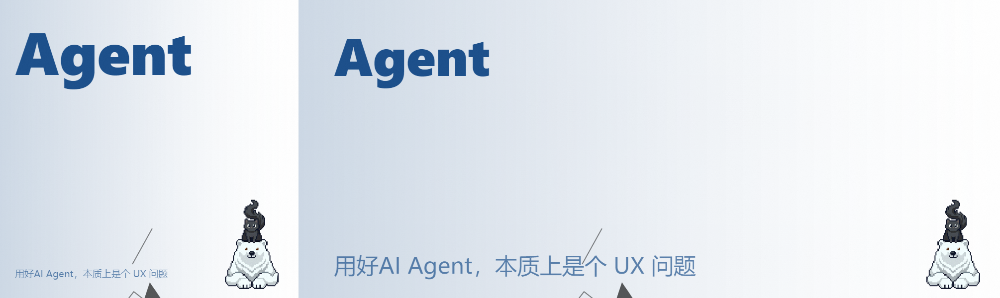

# WechatCoverHTML

<div align="center">



**微信公众号封面图生成工具 — Claude Code Skill**

根据文章标题自动生成专业的公众号封面图，支持 3.35:1 拼接图（左侧 1:1 转发图 + 右侧 2.35:1 信息流图）

[English](#english) · [中文](#中文) · [快速开始](#快速开始) · [安装](#安装) · [使用方式](#使用方式)

</div>

---

## 中文

### 项目简介

WechatCoverHTML 是一个 Claude Code Skill，可根据文章标题自动生成微信公众号封面图。

**核心功能：**
- 自动识别标题关键词，匹配专业配色方案
- 输出 3.35:1 拼接图，同时适配转发场景（1:1）和信息流场景（2.35:1）
- 左右两图共享几何图形元素，保持视觉一致性
- 支持自定义吉祥物 Logo

### 封面效果示例


> 示例封面：「用好AI Agent，本质上是个 UX 问题」

### 配色方案

共 6 档，**单色为主，禁止撞色**：

| 档位 | 背景色 | 图形/文字色 | 适用主题 |
|------|--------|-------------|----------|
| 黑白 | #FFFFFF | #111111 | 商务/技术 |
| 米色 | #F5F0E8 | #7A5230 | 温暖/生活 |
| 浅粉 | #FADADD | #B83A50 | 女性/情感 |
| 天空蓝 | #BFDCEF | #1A4E8A | 科技/理性 |
| 翠鸟绿 | #C8E6C9 | #1E5E2E | 增长/自然 |
| 清华紫 | #DDD0E8 | #5A3E7A | 创意/学术 |

### 布局规格

所有图高度统一为 **600px**：

- **2.35:1 信息流图**：1410 × 600 px
- **1:1 转发图**：600 × 600 px
- **拼接总图**：2010 × 600 px（3.35:1）

**左侧 1:1 转发图**：关键字大字（占图面 40%+）在左上，标题小字在左下，logo 在右下

**右侧 2.35:1 信息流图**：关键字大字在左上，标题小字在左下，几何装饰图形在右侧，logo 在右下

背景：左深右浅渐变 + 白色颗粒纹理叠加

### 快速开始

#### Node.js API

```javascript
const { generateCover } = require('./src/index');

const result = await generateCover('你的文章标题', {
  colorScheme: '天空蓝',  // 可选，不传则自动推断
  outputPath: './output.png',  // 输出路径
  logoPath: './asset/inkspacebitbase200png.png',  // 可选 logo
});
// result.imagePath  — 拼接后 3.35:1 PNG 路径
// result.html1Path   — 1:1 HTML 过程文件（用于调试）
// result.html235Path — 2.35:1 HTML 过程文件（用于调试）
```

#### 命令行

```bash
node src/main.js "文章标题" [输出路径]
```

### 安装

```bash
npm install
```

### 项目结构

```
wechatcoverHTML/
├── SKILL.md                      # Skill 定义文件
├── README.md                     # 本文件
├── package.json
├── cover.png                     # 生成示例
├── src/
│   ├── index.js                  # generateCover() 主入口
│   ├── color-schemes.js         # 配色方案 + 关键词推断
│   ├── geometry-pool.js          # 基于 seed 的几何图形池
│   ├── layout-engine.js          # 布局计算
│   ├── html-generator.js         # HTML 生成（渐变+颗粒+图形+文字）
│   ├── screenshot.js             # Puppeteer 截图
│   ├── stitcher.js               # Canvas 左右拼接
│   └── main.js                   # CLI 入口
└── asset/
    └── inkspacebitbase200png.png # 吉祥物 logo
```

### 依赖

- **Node.js** (ES6+)
- **puppeteer** — 浏览器截图
- **canvas** — 图片拼接
- **html2canvas** — HTML 转图片

---

## English

### Overview

WechatCoverHTML is a Claude Code Skill that automatically generates WeChat public account cover images from article titles.

**Key Features:**
- Auto-detect keywords from titles and match professional color schemes
- Output 3.35:1 stitched image (1:1 forward image on left + 2.35:1 feed image on right)
- Both images share geometric elements for visual consistency
- Support custom mascot/logo

### Example Output


> Example cover: "Using AI Agents well is essentially a UX problem"

### Color Schemes

6 schemes available, **monochromatic with no color clashing**:

| Scheme | Background | Text/Graphics | Best For |
|--------|-----------|---------------|----------|
| B&W | #FFFFFF | #111111 | Business/Tech |
| Beige | #F5F0E8 | #7A5230 | Warmth/Lifestyle |
| Pink | #FADADD | #B83A50 | Female/Emotion |
| Sky Blue | #BFDCEF | #1A4E8A | Tech/Rational |
| Kingfisher | #C8E6C9 | #1E5E2E | Growth/Nature |
| Tsinghua Purple | #DDD0E8 | #5A3E7A | Creative/Academic |

### Layout Specs

All images share a uniform height of **600px**:

- **2.35:1 Feed Image**: 1410 × 600 px
- **1:1 Forward Image**: 600 × 600 px
- **Stitched Total**: 2010 × 600 px (3.35:1)

**Left 1:1 Forward Image**: Large keyword text (40%+ of image) at top-left, title text at bottom-left, logo at bottom-right

**Right 2.35:1 Feed Image**: Large keyword text at top-left, title text at bottom-left, geometric decorations on right, logo at bottom-right

Background: left-dark-to-right-light gradient + white grain texture overlay

### Quick Start

#### Node.js API

```javascript
const { generateCover } = require('./src/index');

const result = await generateCover('Your article title', {
  colorScheme: 'Sky Blue',  // optional, auto-detected if omitted
  outputPath: './output.png',
  logoPath: './asset/inkspacebitbase200png.png',  // optional logo
});
// result.imagePath  — stitched 3.35:1 PNG path
// result.html1Path   — 1:1 HTML intermediate (for debugging)
// result.html235Path — 2.35:1 HTML intermediate (for debugging)
```

#### CLI

```bash
node src/main.js "Article Title" [output path]
```

### Installation

```bash
npm install
```

### Project Structure

```
wechatcoverHTML/
├── SKILL.md
├── README.md
├── package.json
├── cover.png
├── src/
│   ├── index.js
│   ├── color-schemes.js
│   ├── geometry-pool.js
│   ├── layout-engine.js
│   ├── html-generator.js
│   ├── screenshot.js
│   ├── stitcher.js
│   └── main.js
└── asset/
    └── inkspacebitbase200png.png
```

### Dependencies

- **Node.js** (ES6+)
- **puppeteer** — browser screenshot
- **canvas** — image stitching
- **html2canvas** — HTML to image

---

## License

ISC
